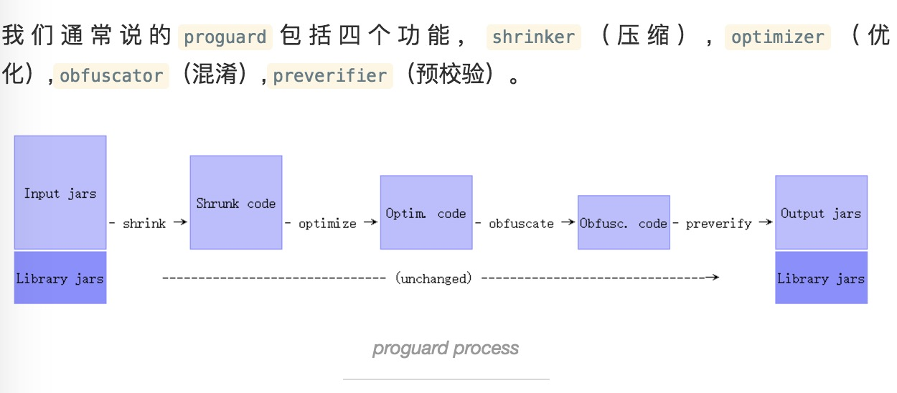
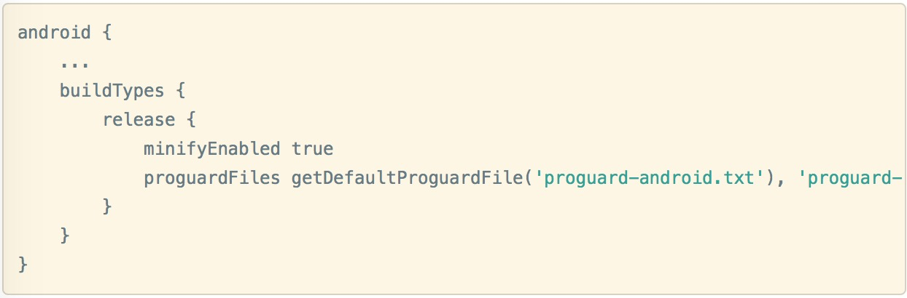
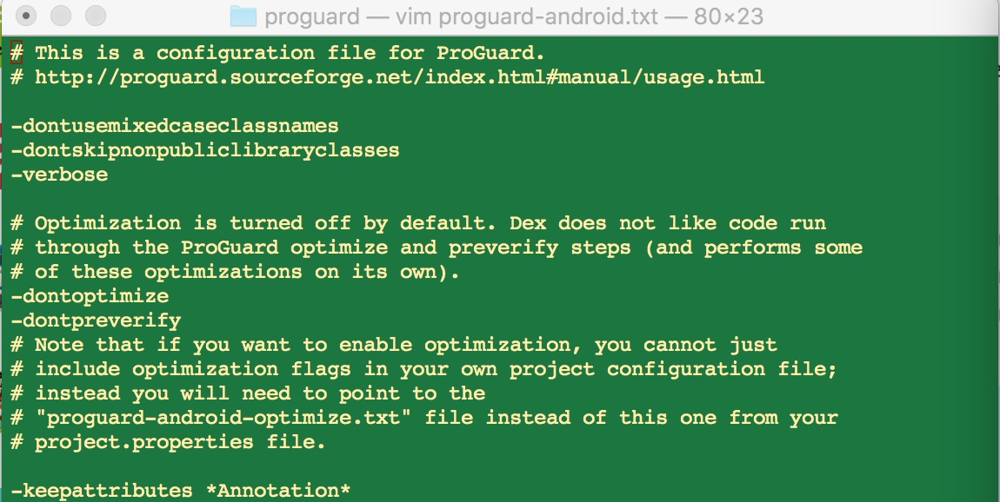
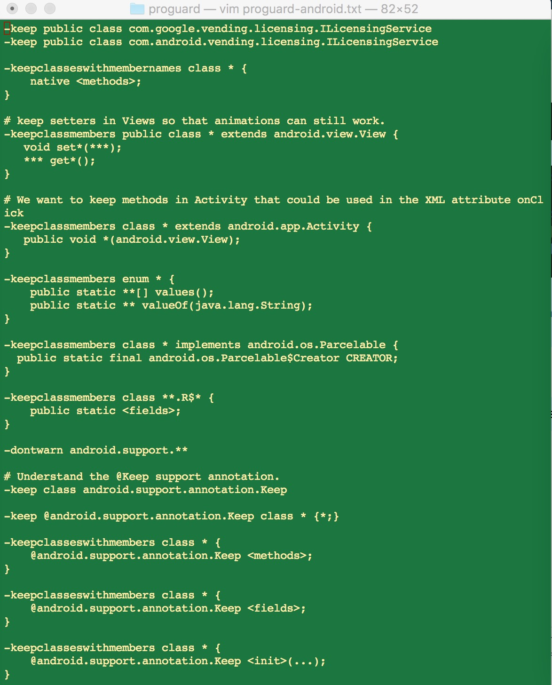
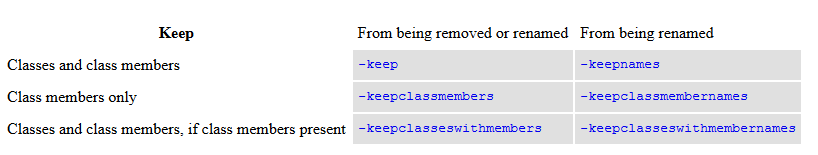
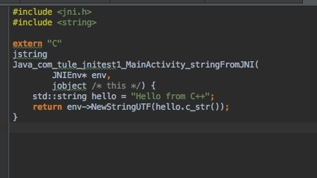
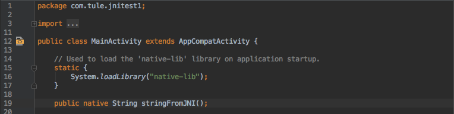
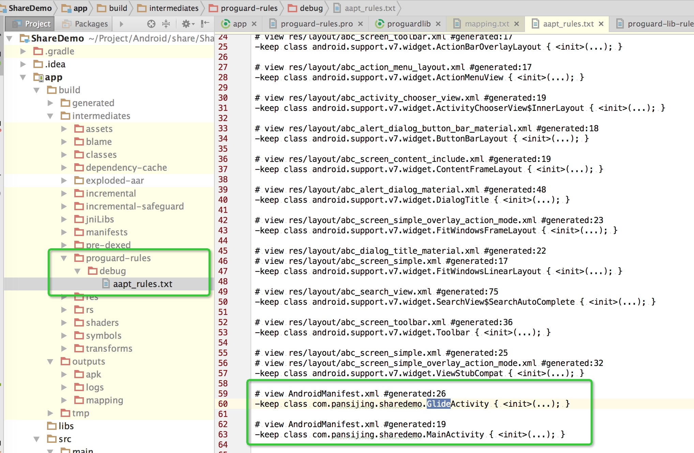
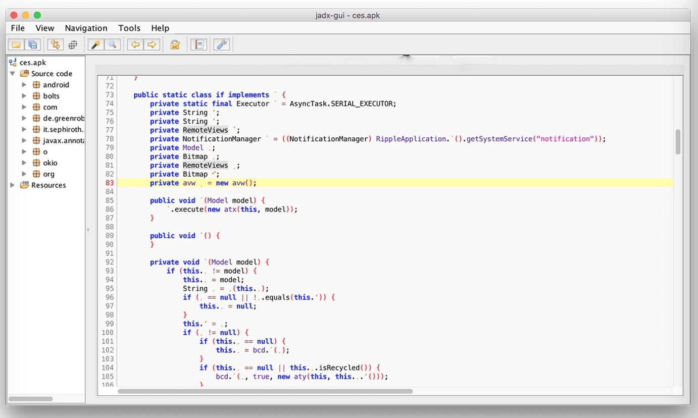

<!-- $theme: gaia -->

# 混淆分享

## 说明：

* 作者：pighead
* 审稿人：图乐，Larry，老枯，杀破狼，杨志康，老机长，mYm
* 邮箱：zhu_huanuan@hotmail.com
* 时间：2016/12/09
* 修改：2016/12/12 版本1.0.0
* 修改：2016/12/13 版本1.1.0
* 版本：1.2.0

---

## 介绍Proguard的功能

* ProGuard是一个开源的Java代码混淆器，它无法混淆Native代码，资源文件drawable、xml等。

---

## 说在前面
* 这里我们直接用Android Studio来说明如何进行混淆

 > getDefaultProguardFile()可以返回这两个文件的绝对路径   
 > proguardFiles 可以配置多个混淆文件

---

## 指令解释--优化的说明

---

### 配置指令解释
* **-skipnonpubliclibraryclasses** 指定读取引用库文件的时候跳过非public类。这样做可以提高处理速度并节省内存。一般情况下非public在应用内是引用不到的，跳过它们也没什么关系。但是，在一些java类库中中出现了public类继承非public类的情况，这样就不能用这个选项了。这种情况下，会打印一个警告出来，提示找不到类。
* **-dontskipnonpubliclibraryclasses** 跟上面的参数相对。版本4.5以上，这个是默认的选项。

---

* **-dontusemixedcaseclassnames** 指定在混淆的时候不使用大小写混用的类名。默认情况下，混淆后的类名可能同时包含大写字母和小写字母。这样生成jar包并没有什么问题。只有在大小写不敏感的系统（例如windows）上解压时，才会涉及到这个问题。因为大小写不区分，可能会导致部分文件在解压的时候相互覆盖。如果有在windows系统上解压输出包的需求的话，可以加上这个配置。
* **-verbose** 声明在处理过程中输出更多信息。添加这项配置之后，如果处理过程中出现异常，会输出整个StackTrace而不是一条简单的异常说明。

---

* **-dontoptimize** 声明不优化代码。Dex会自己优化的
* **-dontpreverify** 声明不预校验即将执行的类。默认情况下，在类文件的编译版本为java micro 版本或者大于1.6版本时，预校验是开启的。目标文件针对java6的情况下，预校验是可选的；针对java7的情况下，预校验是必须的，除非目标运行平台是Android平台，设置它可以节省一点点时间。
* __-keepattributes \*Annotation\*__ 表示对注解中的参数进行保留

---

### 查看默认的混淆规则

* 保持类名不变，但是类内部的属性，方法会变
 > -keep public class com.google.vending.licensing.ILicensingService  
 > -keep public class com.android.vending.licensing.ILicensingService
* 保留JNI的方法，注意：类名和包名也已经保留了，生成的JNI函数名，是根据包名+类名+函数名生成的
 > -keepclasseswithmembernames class * {   
 >   native \<methods\>;  
 > }
* 保留View的方法，动画效果就会依然存在
 > -keepclassmembers public class * extends android.view.View {  
 >  void set*(\*\*\*);  
 >  \*\*\* get*();  
 > }
* 保留xml的布局文件中使用onClick方法
 > -keepclassmembers class * extends android.app.Activity {  
 >  public void *(android.view.View);  
 > } 
* 保留枚举类的一些函数
 > -keepclassmembers enum * {  
 >   public static **[] values();  
 >   public static ** valueOf(java.lang.String);         
 > }  
* 保留实现Parcelable接口的内部类
 > -keepclassmembers class * implements android.os.Parcelable {  
 > public static final android.os.Parcelable$Creator CREATOR;  
 > }
* 保留自动生成的R类里的属性
 > -keepclassmembers class \*\*.R$* {  
 >   public static \<fields\>;  
 > }
* 不要对support包进行警告
 > -dontwarn android.support.**
* 对@keep注解的规则，适用于类，方法，属性，初始化
 > -keep class android.support.annotation.Keep   
 > -keep @android.support.annotation.Keep class * {*;}   
 > -keepclasseswithmembers class * {  
 >   @android.support.annotation.Keep \<methods\>;  
 > }  
 > -keepclasseswithmembers class * {  
 >   @android.support.annotation.Keep \<fields\>;  
 > }  
 > -keepclasseswithmembers class * {  
 >   @android.support.annotation.Keep \<init\>(...);  
 > }

---

### keep指令解释
* **-keep [,modifier, ...] class_specification** 指定类和类的成员变量是入口节点，保护它们不被移除混淆。
* **-keepclassmembers [,modifier] class_specification** 保护的指定的成员变量不被移除、优化、混淆。
* **-keepclasseswithmembers [,modifier,...] class_specification** 拥有指定成员的类将被保护，根据类成员确定一些将要被保护的类。
* **-keep** 与 **-keepnames**的关系一开始理解的时候有些混乱。但是它们背后是有一定规则的，下面的表格展示了它们的联系与不同

---

* 如果不确定自己该用哪个的话，就用 **-keep** 吧，它能保证匹配的类在压缩这一阶段不被移除，并且在混淆阶段不会被重新命名。

---

### keep-demo
* 先看如下两个比较常用的命令，很多童鞋可能会比较迷惑以下两者的区别
 > -keep class com.pansijing.test.**  
 > -keep class com.pansijing.test.*
* 一颗星表示只是保持该包下的类名，而子包下的类名还是会被混淆；两颗星表示把本包和所含子包下的类名都保持；用以上方法保持类后，你会发现类名虽然未混淆，但里面的具体方法和变量命名还是变了，这时如果既想保持类名，又想保持里面的内容不被混淆，我们就需要以下方法了
 > -keep class com.pansijing.test.* {*;}

---

## 混淆后生成的文件
* **mapping.txt**：(配置指令： **-printmapping** )混淆前后代码对照，在混淆之后如果出现问题，需要查找此文件进行定位---养成保存mapping.txt文件的习惯
* **dump.txt**：(配置指令： **-dump** )APK内所有class文件结构
* **seeds.txt**：(配置指令： **-printseeds** )没有被混淆的类和成员
* **usage.txt**：(配置指令： **-printusage** )源代码中被删除的代码

---

## retrace的使用说明--具体操作参见参考的博客
* ProGuard 在 Android 应用发布的时候经常会用来混淆代码。 混淆后的应用发布到市场上，当用户反馈 Crash 的时候， 开发者看起来就不那么好定位问题根源了。
* 还好 ProGuard 本身提供了一个还原工具。 要使用还原工具之前，你需要保存每次发布应用混淆后的 proguard/mapping.txt 文件。
* 在每次用 ProGuard 发布应用的时候， 都会在项目目录下的 proguard 目录中创建新的 mapping 文件。该文件记录了 每个类对应混淆后的类以及方法。

---

## 不混淆的类型
* 反射用到的类不混淆

---
* JNI方法不混淆  
  
  
---
* Manifest中类不混淆（默认）  

---
* 四大组件和Application子类、Framework层下所有类默认不混淆
* Parcelable子类和Creator静态成员变量不混淆（BadParcelableException，怕了吧）
* GSon、FastJson等库时，Json对象不混淆（注解可解决此问题）
* 第三方开源库或引用其他第三方SDK，加入对应混淆规则（或者库在打包aar时有指定consumerProguardFiles）
* WebView的JS调用接口不混淆

---

## library与组件化的混淆问题
* 现在的问题：所有的混淆规则都是加在app的proguard文件内，一旦library与组件化，需要调整时，必须调整app里的proguard规则
* 解决方法1:使用@keep，缺陷就是要标记很多地方
* 解决方法2:使用在build.gradle文件内的defaultConfig内的consumerProguardFiles，也就是把混淆规则传递过去

---

## 玩出花的节奏
* 先来看看这个图：

---
* 这种混淆，估计会让人崩溃
* 见证奇迹的地方：
 > 指定外部模糊字典  
 > -obfuscationdictionary dictionary.txt  
 > 指定class模糊字典  
 > -classobfuscationdictionary filename  
 > 指定package模糊字典  
 > -packageobfuscationdictionary filename  

---
## 经验之谈
* 代码混淆的时候记得加上在混淆文件里面记得加上这句--keep住源文件以及行号： 
 > -keepattributes SourceFile,LineNumberTable
* 保留mapping文件，方便后续的排查问题
* 编译时，出现有warning通不过，定位到warning，然后keep那个对应的包下的文件，同时添加dontwarn对应包下的文件
 > -keep class com.xxx.\*\* {*;}  
 > -dontwarn com.xxx.\*\*

---
* 发布一款应用除了设minifyEnabled为ture，你也应该设置zipAlignEnabled为true，像Google Play强制要求开发者上传的应用必须是经过zipAlign的，zipAlign可以让安装包中的资源按4字节对齐，这样可以减少应用在运行时的内存消耗。

---
## 参考的博客
* 查看Proguard规则：http://www.jianshu.com/p/60e82aafcfd0
* 查看Proguard规则：http://hanhailong.com/2015/12/28/Android%E8%BF%9B%E9%98%B6%E4%B9%8BProGuard%E4%BB%A3%E7%A0%81%E6%B7%B7%E6%B7%86/
* 参考keep规则的说明：http://mp.weixin.qq.com/s?__biz=MjM5NDkxMTgyNw==&mid=2653058426&idx=1&sn=79de1cc8a8fbee6f0ffb220a9a958311&chksm=bd5656468a21df501eca228320a553564b42f212e1b410ea9cc463295f2f1aea190a5ae2ccf7&mpshare=1&scene=23&srcid=1212fHyTuX7spYawLEl6Zbp8#rd
* 参考keep规则的说明：http://blog.csdn.net/guolin_blog/article/details/50451259
* retrace的使用说明：http://blog.chengyunfeng.com/?p=545
* 参考经验之谈：https://segmentfault.com/a/1190000004461614
* 参考经验之谈：http://www.jianshu.com/p/7436a1a32891
* 参考经验之谈：http://www.jianshu.com/p/f3455ecaa56e
* idea参考的：https://github.com/krschultz/android-proguard-snippets
* idea参考的：https://github.com/msdx/android-proguard-cn
* idea参考的：https://github.com/zhonghanwen/AndroidProguardPlugin
* idea参考的：https://github.com/AndroidKnife/proguard-config
* 组件化的问题：http://stackoverflow.com/questions/30201420/how-to-include-a-proguard-configuration-in-my-android-library-aar
* 组件化的问题：http://blog.hwangjr.com/2015/11/25/%E6%90%9E%E5%AE%9AAndroid-Proguard/
* 组件化的问题：https://github.com/yongjhih/proguard-annotations
* 参考玩出花的节奏：http://qbeenslee.com/article/about-wandoujia-proguard-config/
* 参考玩出花的节奏：https://github.com/qbeenslee/gradle-proguard-dictionary

